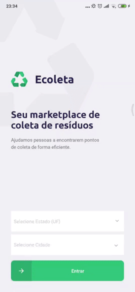

# Next Level Week (NLW) 01 - Ecoleta

Nessas 5 aulas da semana NLW foi desenvolvida uma aplicação com backend (Node+Express), frontend (React), e aplicativo mobile (React Native)

## Server
No servidor foi usado Node e Express como framework de desenvolvimento de APIs

Foi criado as seguintes rotas:

### Rota de arquivos estáticos
```
GET /uploads/{file}
``` 

### Rota de listagem de items
```
GET /items

retorno:
[
  {
    "id": 1,
    "image": "lampadas.svg",
    "title": "Lâmpadas",
    "image_url": "http://localhost:3333/uploads/lampadas.svg"
  },
 ...
  {
    "id": 6,
    "image": "oleo.svg",
    "title": "Óleo de Cozinha",
    "image_url": "http://localhost:3333/uploads/oleo.svg"
  }
]
```
### Rota de criação de pontos de coleta
```
POST /points (com form data)

retorno:
{
  "id": 2,
  "image": "49a1665a74c6-imagem_1.jpeg",
  "name": "Mercado do Teló",
  "email": "telo@mercado.com",
  "whatsapp": "+5511912345678",
  "latitude": -23.5919,
  "longitude": -46.818,
  "city": "Cotia",
  "uf": "SP"
}

```
### Rota de lista pontos de coleta por id
Essa rota faz relacionamento com dados de items
```
GET /points/{id}

retorno:
{
  "point": {
    "id": 5,
    "image": "3b0b4556c571-photo-1567408773508-4e5da32afafd.jpeg",
    "name": "Mercado da Mile",
    "email": "mile@mercado.com.br",
    "whatsapp": "+5511977066119",
    "latitude": -23.5874,
    "longitude": -46.816,
    "city": "Cotia",
    "uf": "SP",
    "image_url": "http://127.0.0.1:3333/uploads/3b0b4556c571-photo-1567408773508-4e5da32afafd.jpeg"
  },
  "items": [
    {
      "title": "Pilhas e Baterias"
    },
    {
      "title": "Papéis e Papelão"
    },
    {
      "title": "Resíduos Orgânicos"
    }
  ]
}
```
### Rota de lista pontos de coleta por item, cidade e/ou estado
```
GET /points?city=Cotia&uf=SP&items=1,5,6

retorno:
[
  {
    "id": 1,
    "image": "8049c94ab40e-imagem_2.jpeg",
    "name": "Mercado da Rocketseat",
    "email": "mercado@rocketseat.com.br",
    "whatsapp": "+5511987651234",
    "latitude": -23.589,
    "longitude": -46.822,
    "city": "Cotia",
    "uf": "SP",
    "image_url": "http://127.0.0.1:3333/uploads/8049c94ab40e-imagem_2.jpeg"
  },
  {
    "id": 2,
    "image": "49a1665a74c6-imagem_1.jpeg",
    "name": "Mercado do Teló",
    "email": "telo@mercado.com",
    "whatsapp": "+5511912345678",
    "latitude": -23.591,
    "longitude": -46.818,
    "city": "Cotia",
    "uf": "SP",
    "image_url": "http://127.0.0.1:3333/uploads/49a1665a74c6-imagem_1.jpeg"
  }
]
```

## Web

No projeto web foi utilizado React, e mais algumas libs auxiliares para uma página totalmente funcional.
Com upload de arquivo com validação do arquivo, busca de dados de estado usando a API do IBGE e a partir do estado selecionado as cidade são carregadas ainda utilizando outra rota da API do IBGE.
No mapa foi usado Leaflet e React Leaflet.

## Mobile
No projeto mobile foi utilizado React Native, ainda usando API do IBGE para no **Selected Picker** os dados serem puxados dinamicamente.

## Exibindo GIF das telas web e mobile

<p align="center">
    
    
</p>
<p align="center">
    GIF: mostrando as páginas web e as telas desenvolvidas.
</p>